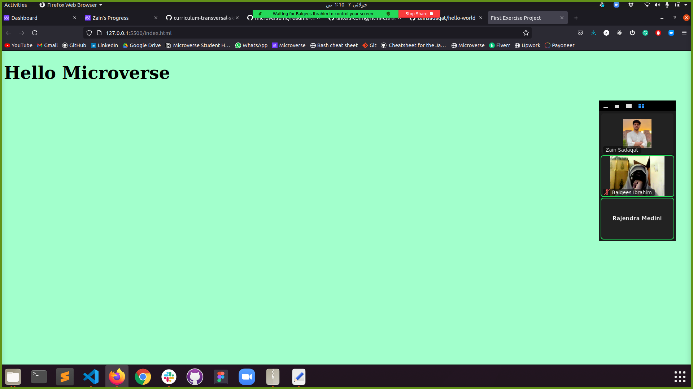

# Hello Microverse

> I built my first web project using HTML5 and CSS3

## Built With

- HTML5 & CSS3

## Getting Started

**This is an example of how you may give instructions on setting up your project locally.**
**Modify this file to match your project, remove sections that don't apply. For example: delete the testing section if the currect project doesn't require testing.**

To get a local copy up and running follow these simple example steps.

### Prerequisites

### Setup

### Install

### Usage

### Deployment

## Author

- GitHub: [@githubhandle](https://github.com/zainsadaqat)
- Twitter: [@twitterhandle](https://twitter.com/zain_sadaqat)
- LinkedIn: [LinkedIn](https://linkedin.com/in/zainsadaqat)

## 🤝 Contributing

Contributions, issues, and feature requests are welcome!

Feel free to check the [issues page](../../issues/).

## Show your support

Give a ⭐️ if you like this project!

## Acknowledgments

- Hat tip to anyone whose code was used
- Inspiration
- etc

## 📝 License

This project is [MIT](./MIT.md) licensed.
